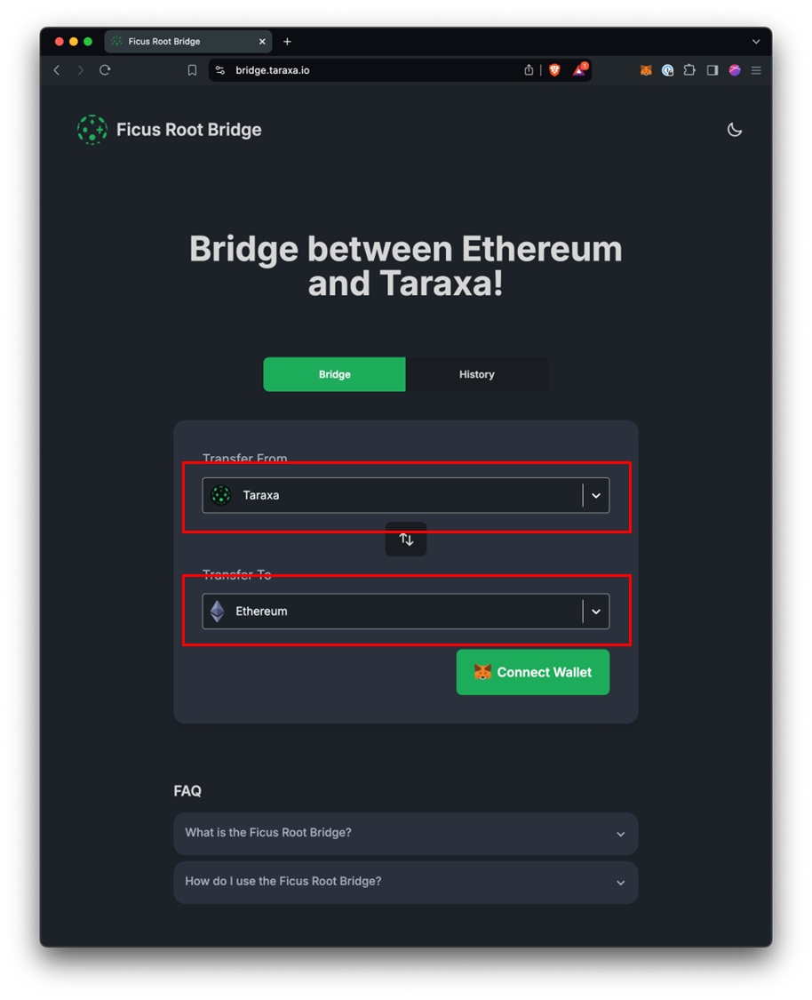

# 🚀 Quickstart

## Building on Taraxa's EVM-compatible Network = super easy

Hi! Thanks for checking out Taraxa's Layer-1 network. Here are a few quick links to get you started right away.&#x20;

* [Create a wallet](../wallet/) using tools you're already familiar with such as Metamask and Ledger
* Get some testnet tokens on the faucet on the Taraxa Explorer \[WIP]&#x20;
* [Connecting to the Taraxa network](connect-to-taraxas-network.md) via our dev deployed RPC endpoint, or running a node of your own&#x20;
* [Deploying a smart contract](smart-contracts-wip.md) is super easy, all ETH-compatible tools just work&#x20;
* [Taraxa RPC specifications](taraxa-rpc-specs.md) highlights Taraxa's near-100% compatibility with ETH's RPC specs, with a few minor quirks & exceptions

Let's get building!&#x20;

## A step-by-step example

To show how easy it is to develop on Taraxa and its ETH-compatibility, let's start with a simple step-by-step example. We're going to deploy a simple contract onto Taraxa's mainnet via [Remix](https://remix.ethereum.org/).&#x20;

* Go to [Remix](https://remix.ethereum.org/), you'll see the IDE

<figure><figcaption></figcaption></figure>

* Let's start with one of the pre-populated default contracts in the Remix IDE, `1_Storage.sol`.&#x20;

<figure><figcaption></figcaption></figure>

*

