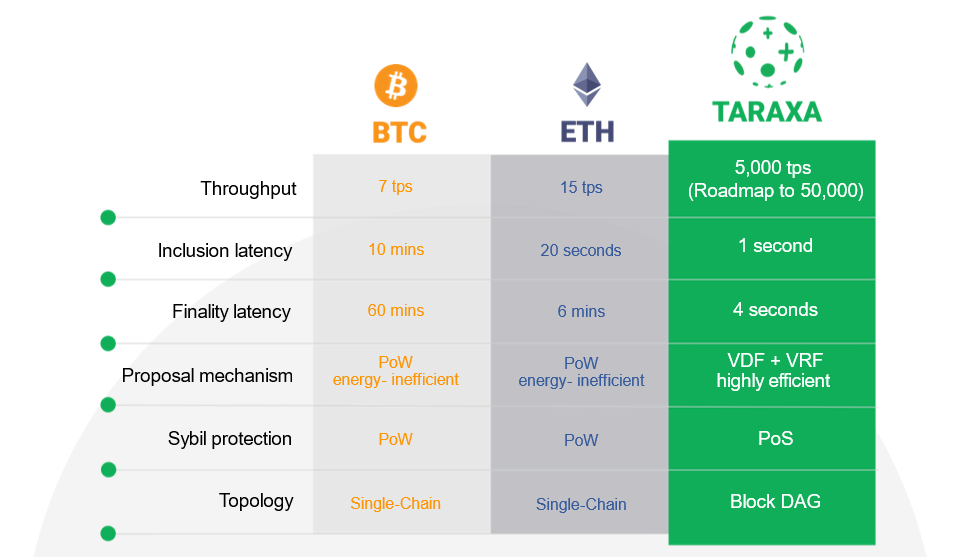

# Layer-1 Tech

## How is Taraxa's Layer-1 tech different? 

**TLDR**: Taraxa is able to massively scale throughput with true finality without sacrificing security or decentralization. 

Taraxa is designed to break the tradeoffs of the trilemma proposed by Vitalik, with a unique block DAG topology at the center of an inclusive protocol \(unlike single-chained topologies\), enabling the network to massively scale without having to sacrifice security or decentralization. 

We replaced traditional PoW with a fair and efficient proposal mechanism based on leveraging a combination of VRF and VDF algorithms that replicates PoW's secure, decentralized, and provable randomness but with a minimal carbon footprint. 

To further support application's business needs, we introduced an asynchronous and immediate finality to ensure transactions are never reversed, a massively optimized transactional layer around the VM to remove executional throughput bottlenecks, and speculative execution to support stateless transactions such as data anchoring of informal transactions. 

More details: 

* Whitepaper's [abstract ](../tech-whitepaper/abstract.md)for a quick overview of our technology
* Our [consensus article series](https://medium.com/taraxa-project/tagged/taraxa-tech) for a more friendly and thorough explanation
* The [architecture ](../tech-whitepaper/taraxa-architecture.md)section of our whitepaper for a more technical description

## How does Taraxa resolve the **scalability** trilemma?

The scalability trilemma, first proposed by Vitalik Buterin, states that it's very difficult to improve scalability without sacrificing security and/or decentralization. For example, if the network consists of a single entity processing all transactions, then this network could have very good throughput and can never be forked, but it is a centralized system and cannot be trusted. 

The trilemma is largely a limitation of single-chain topology used by the classic BTC and ETH blockchain networks. Taraxa's block DAG architecture enables an inclusive protocol that specifically breaks this tradeoff and allows massive throughput scaling beyond what's possible with the single-chain topology. 

Simply put, block DAG admits many blocks from many nodes simultaneously with no sacrifice to security or decentralization, while a single-chain topology only admits one block at a time.

More details: 

* [Single chain's tough tradeoffs](https://medium.com/taraxa-project/single-chains-tough-trade-offs-1-5-55a407a1eb10)
* [Block DAG and proof of stake](https://medium.com/taraxa-project/block-dag-and-pos-2626b973afd7)
* [Secure and fair ordering](https://medium.com/taraxa-project/taraxa-consensus-3-5-secure-and-fair-block-dag-ordering-ed4203420ac6)
* [Fair and efficient proposals](https://medium.com/taraxa-project/taraxa-consensus-4-5-fair-and-efficient-proposals-e91293bad0b0)

## What's special about Block DAG? 

We chose to implement Block DAG because it is the only technology stack that can massively scale throughput and minimize latency without sacrificing security and decentralization. A super simple explanation of how this is possible is that Block DAG allows many blocks to be proposed simultaneously while making no sacrifices in security, while a single-chain topology can only admit one block at a time. 

More details: 

* Taraxa Architecture \(core section of the Whitepaper\): [https://docs.taraxa.io/tech-whitepaper/taraxa-architecture](https://docs.taraxa.io/tech-whitepaper/taraxa-architecture)
* More readable Medium articles on Taraxa's consensus: [https://medium.com/taraxa-project/tagged/taraxa-tech](https://medium.com/taraxa-project/tagged/taraxa-tech) 

## I thought DAG doesn't have blocks / DAG can't handle double-spend / DAG is feeless / ...? 

We have encountered so many misconceptions about what a directed acyclic graph \(DAG\) is that we wrote an [article specifically to debunk them](https://medium.com/taraxa-project/debunking-misconceptions-about-dag-150fcc6c6e7).

Simply put, DAG is simply a data structure and different projects use it differently. People often confuse the consensus architecture with this simple data structure.  

## Why is finality important? 

Most blockchain topologies today have probabilistic finality, in that you are never 100% sure whether or not the transactions are truly set in stone. For example, in BTC, you get an exponential falloff in the probability that an attacker will be able to catch up to the rest of the network and reorganize the blocks as time \(or in the world of BTC, \# of blocks\) goes forward. This exponential risk falloff gave rise to the “6 block” rule of thumb whereby once you’ve observed 5 blocks built on top of the block containing your transaction, making your transaction “6 blocks deep”, then it is statistically highly unlikely that your transaction would be part of some reordering attack.

In many cases, having a probabilistic finality is fine. But in cases where you’re executing a large number of transactions that are dependent on previous outcomes, or if you’re executing one extremely valuable transaction where you need to be absolutely sure that the transaction won’t be reversed, then finality becomes critically important.

This is why Taraxa has an asynchronous PBFT process that absolutely and continuously finalizes the latest section of the block DAG to ensure true finality. 

More details: 

* [True finality for block DAG](https://medium.com/taraxa-project/taraxa-consensus-5-5-true-finality-for-block-dag-9e5a18538b1e)

## Are there any performance benchmarks? 

Yes, some preliminary tests were conducted and here are the results. Keep in mind that, as the protocol continues to evolve, these numbers will change \(for the better!\). 

## Is Taraxa another "ETH-killer"? 

While the Taraxa protocol is a fully-featured smart contract platform whose performance far outstrips that of the Ethereum network, it is not designed to try to replace Ethereum. 

An ecosystem succeeds if it has a killer application with strong built-in network effects. For Ethereum, it was financial instruments, which started out with ICOs fueled by ERC-20s, to today's myriad DeFi protocols. Despite having many technically-superior alternatives available on the market, users and developers continue to flock to the Ethereum ecosystem because the network effects \(e.g., massive liquidity\) are just too strong. Thus far, copying use cases from Ethereum has proved to be unsustainable and unsuccessful. 

For Taraxa, we had been focused on tracking informal transactions and building a new ecosystem around use cases based them, whether it's providing short-term operational value, or long-term financial value. So while we could do everything Ethereum does better from a technical perspective, the only sustainable way forward is to build a unique use-case ecosystem that organically grows on our network. 

## How will Taraxa grow its Layer-1 ecosystem? 

The Taraxa team believes leading by example. In order to start gaining massive adoption, we need to prove to the world that tracking informal transactions is useful as well as profitable. 

We have built several DApp platforms that are deployed with customers today, and as of this writing we're building a cryto-native application use case as well, stay tuned! 

More details, 

* Protect machine state integrity: \( what is Helio \) 
* Clarify change order management: \( what is Marinate \)
* \( future Dapps \)

