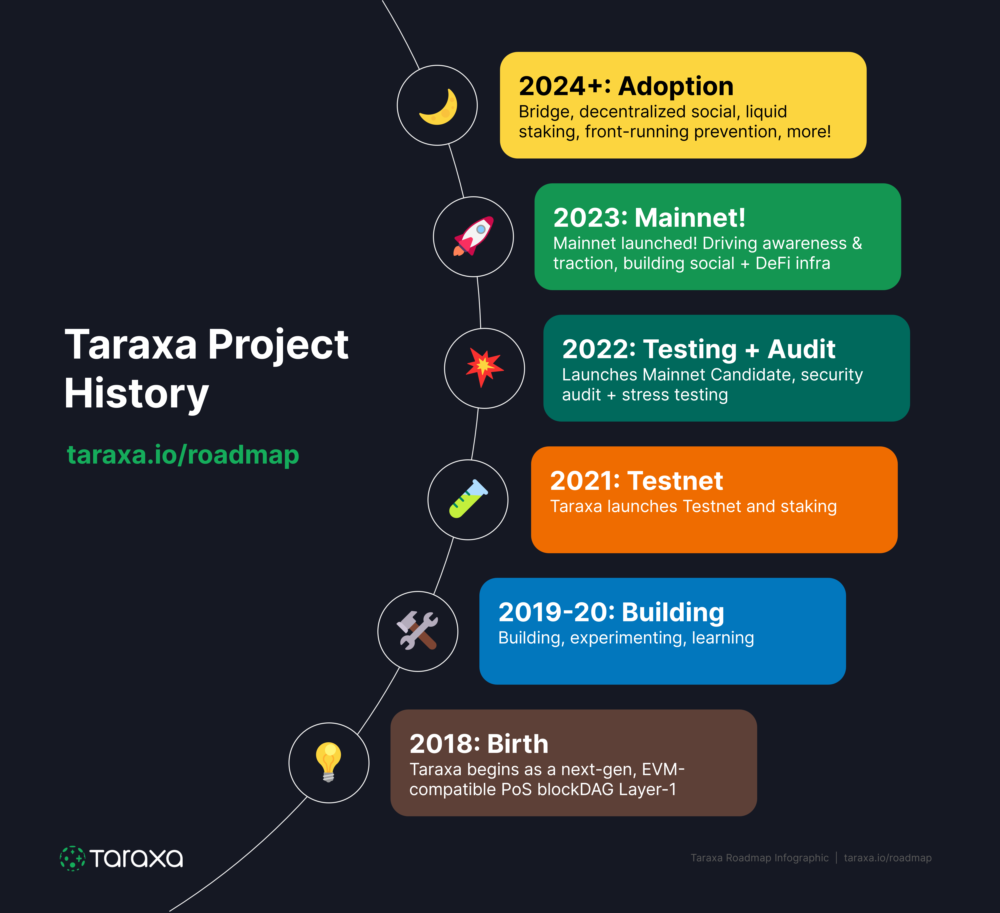

# Staking

## TLDR; Where do I stake, how much is the yield? 

We are currently in the Pre-Staking phase of the total staking rollout. 

* You can stake your TARA tokens on our [community site](https://www.taraxa.io/staking)
* Currently the yield is a flat 20% annualized during the Pre-Staking phase, please note that this is higher than what's stated in the [economics rewards](../tech-whitepaper/economic-model.md#5-5-rewards) section, as we wish to ramp up participation in preparation for the mainnet launch.

More details in this [step-by-step guide](https://medium.com/taraxa-project/how-to-stake-your-tara-a-step-by-step-guide-a03b72dd519e) and the [video walkthrough](https://youtu.be/7ZrzxsEcqps). 

## What is staking?

Staking is a critical part of Taraxa's consensus mechanism, which uses proof of stake to guard against Sybil attacks. In plain language, staking makes attacking a network expensive, and aims to make attacking a network so expensive that the cost far outstrips the benefits. 

When you stake, not only are you helping to secure the network against attacks, you are also earning a yield (rewards) for your efforts. 

## How does Taraxa's staking work? 

Taraxa is rolling out staking in 3 stages. 

* **Pre-Staking** - consists of a simple contract and a web-based UI (part of the community site) that enables simple lock-in of TARA tokens on the ETH network, earning stakers period yields. This is to help us understand user behaviors and get the word out prior to mainnet release. 
* **Mirrored Staking** - a Taraxa-ETH bridge will be set up whereby the stakes on ETH are read over to the staking contracts on the Taraxa testnet, enabling those who have staked to delegate their stake to consensus nodes, helping to test the staking and delegation without putting real assets at risk. 
* **Mainnet Staking** - after mainnet is released, staking and delegation will simply take place on the mainnet via native tokens. 

Please also read more about Taraxa's [economics](../tech-whitepaper/economic-model.md). 

## Which phase are we in right now? 

We're currently in the **PRE-STAKING** phase. 

## Who can participate in Pre-Staking? 

If you meet the following requirements you are able to participate in Pre-Staking, 

* You have some TARA
* You are able to connect your TARA via a web3 connection, such as Metamask, either by holding the TARA inside the Metamask wallet, or connect your Metamask to a hardware wallet where you hold your TARA - it is _highly _recommended to hold your TARA (or any crypto) in a hardware wallet, as it is far more secure
* You have some ETH in your connected wallet to pay for ETH's transaction fees 
* You have registered an account and passed KYC on our [community site](https://community.taraxa.io)
* To comply with recent SEC rulings, United States persons cannot participate in Pre-Staking

## How do I stake in Pre-Staking? 

Here's a [step-by-step guide](https://medium.com/taraxa-project/how-to-stake-your-tara-a-step-by-step-guide-a03b72dd519e) and the [video walkthrough](https://youtu.be/7ZrzxsEcqps).

## Is there a minimum to stake in Pre-Staking? 

There is NO minimum to stake. However, please take into account the transaction fees on the Ethereum network when decide how many TARA to stake. 

## Can I add more to my stake after I have already staked in Pre-Staking? 

Yes, simply use the same staking procedures to add more. 

Please be aware that, once you add more stake, your entire stake's (including your existing stake) locking period will be reset to 30 days again. 

## What is the yield in Pre-Staking? 

Currently the yield is a flat 20% annualized during the Pre-Staking phase

Please note that this is _higher _than what's stated in the [economics rewards](../tech-whitepaper/economic-model.md#5-5-rewards) section, as we wish to ramp up participation in preparation for the mainnet launch.

## How do I get my yields from Pre-Staking? 

Yields are calculated and settled every month, and you can claim their yields through the [claiming function](https://claim.taraxa.io) on the community site after staking. 

After claiming the yield, you have the option to [stake the yields](https://www.taraxa.io/staking) as well, on top of your original stake. 

## How long is the locking period in Pre-Staking? 

When you first stake TARA during Pre-Staking, the tokens are locked for 30 days. After the locking period ends, the tokens become unlocked and you are free to un-stake the tokens. 

## How do I un-stake in Pre-Staking? 

You can un-stake once the initial locking period has elapsed, the option is on the same Staking page. 

## What happens if I don't un-stake after the locking period ends during Pre-Staking? 

As long as you do not un-stake the staked tokens, it will keep earning yields.

You can always re-stake any un-staked tokens, the only cost is a simple transaction fee on ETH. 

## Is there anything else going on besides simple staking yields in Pre-Staking? 

To further encourage community participation, we intend to run contests from time to time. Please stay tuned into our [latest social announcements](https://taraxa.io/latest) so you don't miss out! 

