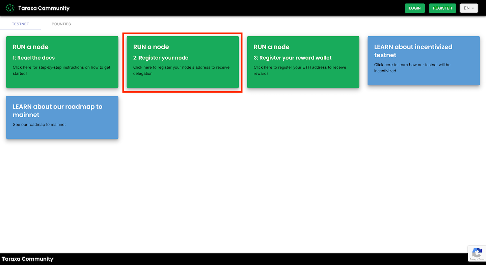

# Getting started

1. Set up a Taraxa node. You can find documentation for your OS [here](https://github.com/Taraxa-project/taraxa-documentation/tree/3daf79a1292f2c8be5315fe5ee36ddb398c291aa/testnet/node-setup/testnet_node_setup/README.md)
2. Find out your node's public wallet address by following this [guide](https://github.com/Taraxa-project/taraxa-documentation/tree/3daf79a1292f2c8be5315fe5ee36ddb398c291aa/testnet/node-setup/testnet_node_setup/README.md)
3. Register the wallet address on our [Community Site](https://community.taraxa.io/)

1. Check out the nodes page in the [Taraxa Explorer](https://explorer.testnet.taraxa.io/nodes) and see how many blocks your node produced

