# Mac

## 1. Download Docker Desktop

You can download Docker Desktop by accessing [this link for Intel Macs](https://desktop.docker.com/mac/stable/amd64/Docker.dmg?utm_source=docker&utm_medium=webreferral&utm_campaign=docs-driven-download-mac-amd64) or [this link for Apple chip Macs](https://desktop.docker.com/mac/stable/arm64/Docker.dmg?utm_source=docker&utm_medium=webreferral&utm_campaign=docs-driven-download-mac-arm64).

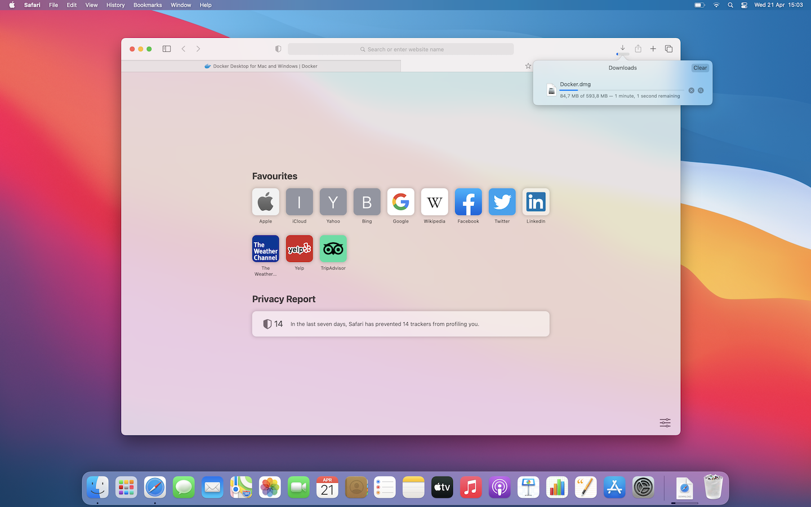

After the download finishes you can find the dmg file in the `Downloads` directory on the Dock.

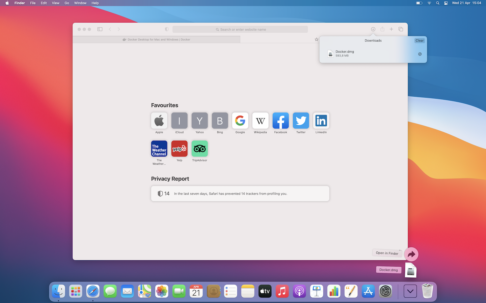

Open the `Docker.dmg` file.

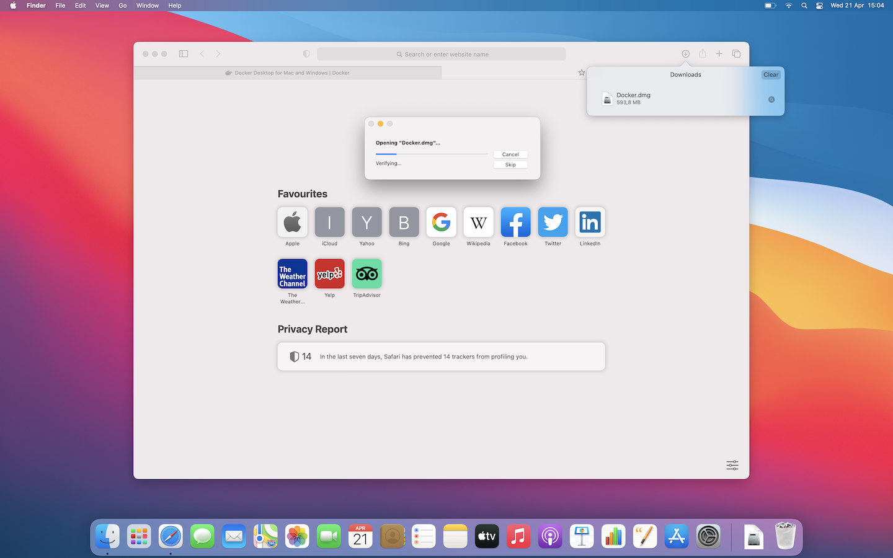

You should see a window similar to the following. Drag and drop the Docker app file into the Applications folder.

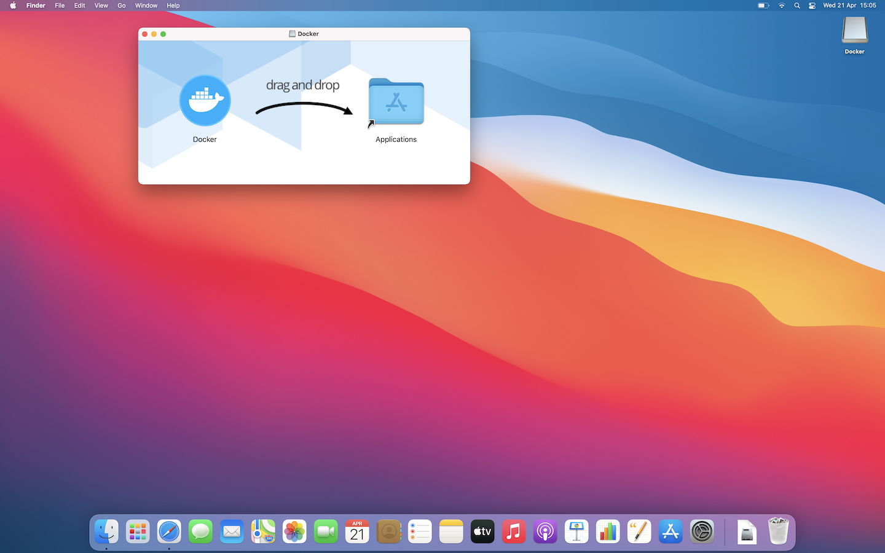

You may get a notice like this because the app was downloaded from the web and not installed from the App Store. You can safely click "Open" here.

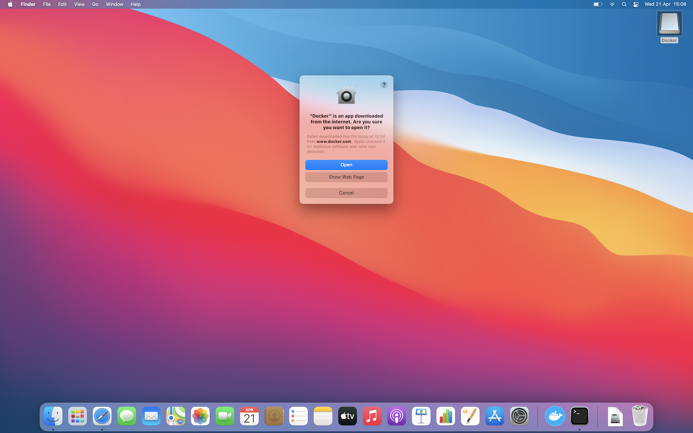

Docker also needs some privileges to install the Docker Helper. Click "OK" and enter your password.

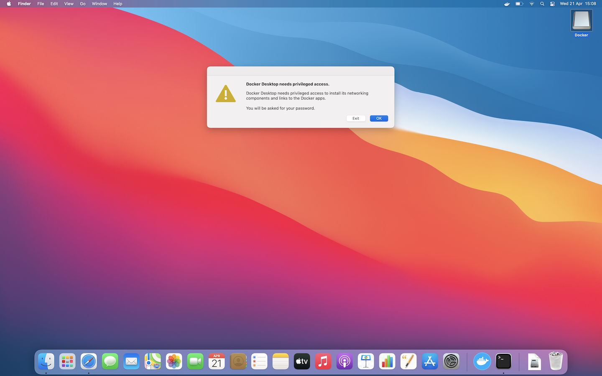

Now you can open Finder and go to the Applications folder. You should see the Docker app.

_NOTE: You can also press CMD + SPACE and search for Docker_


After opening the application you should see a screen similar to this:


When Docker starts you should see this screen. We can close the Docker window now.

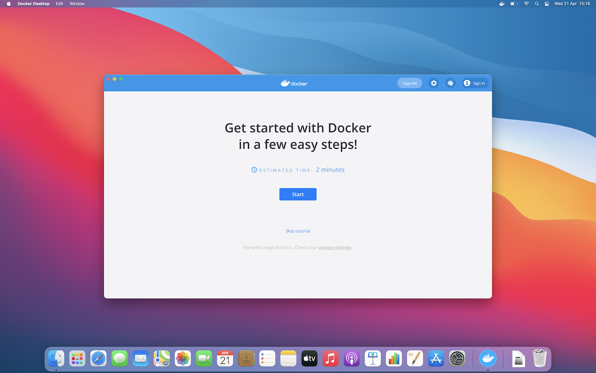

## 2. Open Terminal

We need to use the `Terminal` application in order to start the Taraxa Node image.

You can find the app in the `Utilities` directory under the `Applications`.

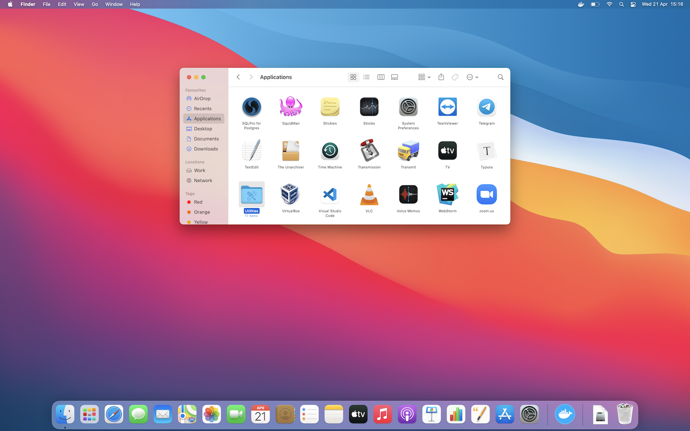

Open the terminal application.

_NOTE: You can also press CMD + SPACE and search for Terminal_

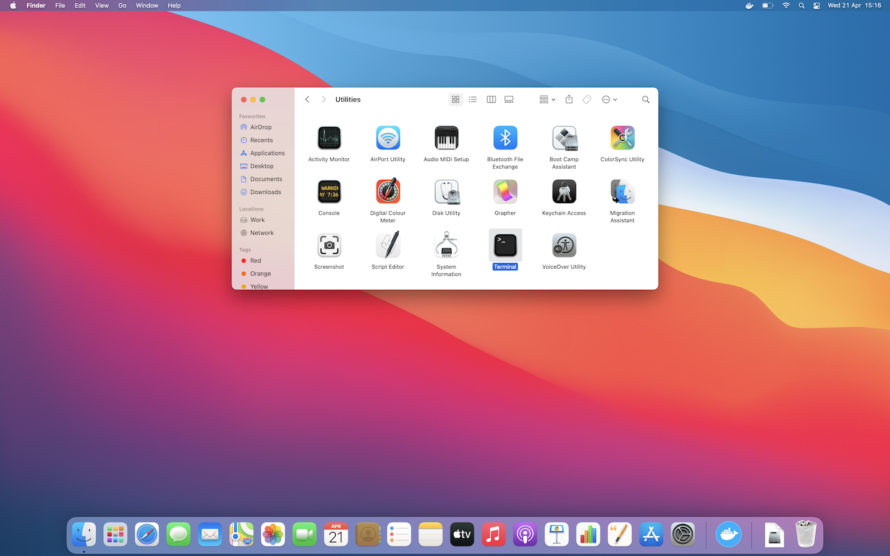

You should see a window similar to this:

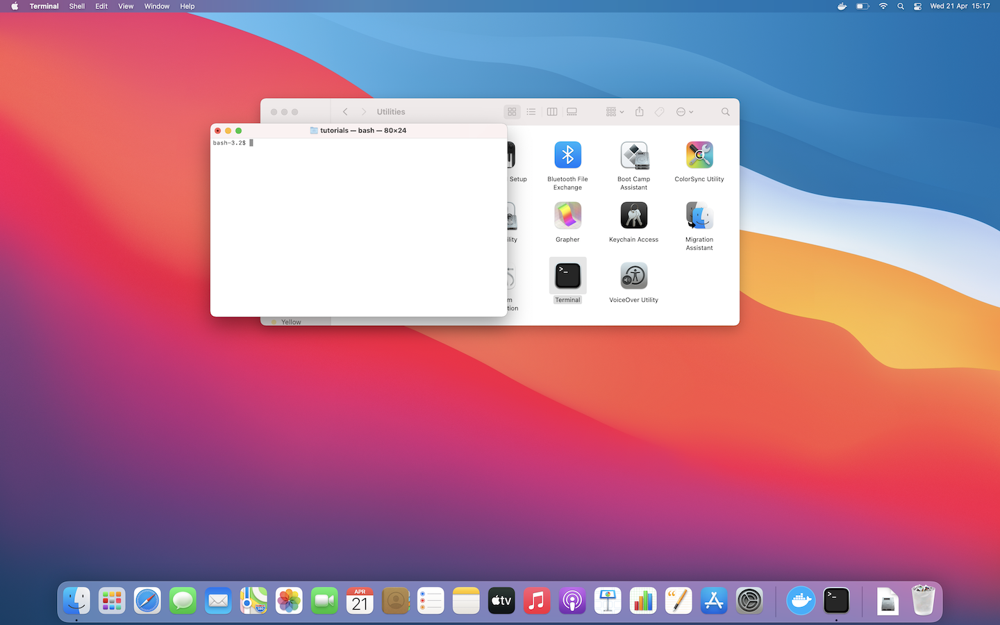

## 3. Start Taraxa

We have to run the following commands one by one:

```bash
cd ~/Desktop
mkdir taraxa
cd taraxa
wget -O docker-compose.yml https://raw.githubusercontent.com/Taraxa-project/taraxa-ops/master/scripts/docker-compose.yml
```


GitHub is blocked in some countries. If you can't run the previous command use the following to start a node without Docker Compose:

```text
docker run --name taraxa-node -it -p 10002:10002 -p 10002:10002/udp -p 7777:7777 -p 8777:8777 taraxa/taraxa-node:latest join testnet
```


Now docker is pulling the Taraxa Node image. You should see something similar to this:


After it finishes pulling the latest version the node will start and you should see something similar to the following:

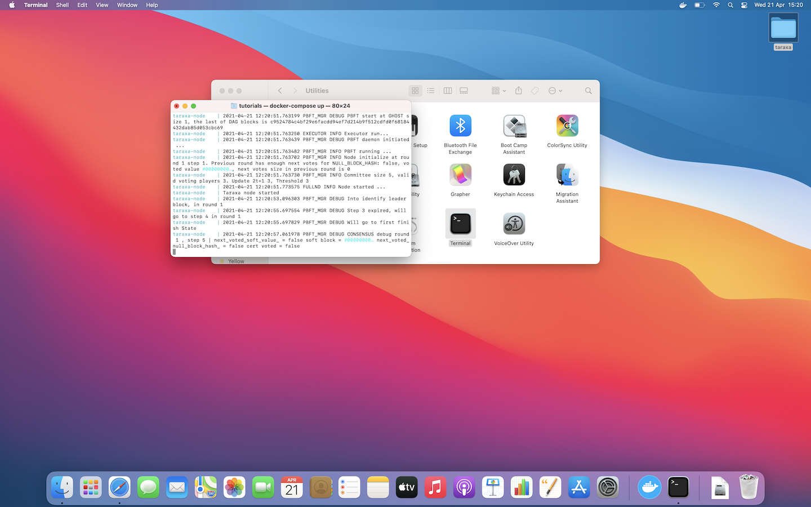

## 4. Updating the Taraxa Node

From time to time we will release new versions of the node software. Try to keep it up to date using the following commands:

```bash
cd ~/Desktop/taraxa
curl -0 https://raw.githubusercontent.com/Taraxa-project/taraxa-ops/master/scripts/docker-compose.yml > docker-compose.yml
docker-compose stop
docker-compose rm -f
docker-compose pull
docker-compose up
```

