# Windows


These instructions are specific to Windows. Instructions are also available for [Mac](broken-reference) and [Linux](broken-reference).


## 1. Install Docker

Before running the node we need to install Docker.

You can download Docker Desktop for Windows from [here](https://desktop.docker.com/win/stable/amd64/Docker%20Desktop%20Installer.exe).

.png>)

After the download finishes you will find the executable file in your downloads folder.

.png>)

Open `Docker Desktop Installer.exe`. and you should see a screen similar to this:

.png>)

Press "Ok" and don't uncheck any of the default options.

Now Docker is installing:

.png>)

After the installation is finished you can click the "Close" button and Docker is going to start automatically.


## 2. Install WSL 2

Docker needs to install extra dependencies for running Linux containers on Windows.

You will get a notice similar to the one below.

_NOTE: Don't close the notice window_

If you click on the provided link a new browser window will open and we can download the dependency.

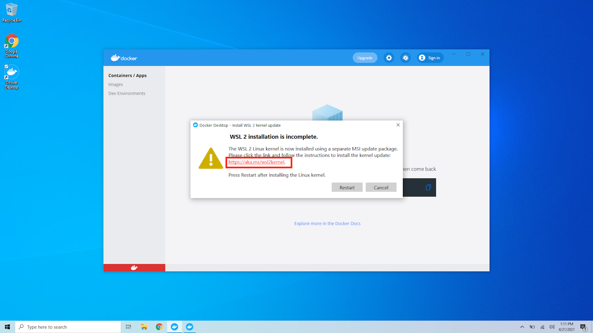

Click on the link under "Download the latest package"


You can find the executable in your downloads folder.

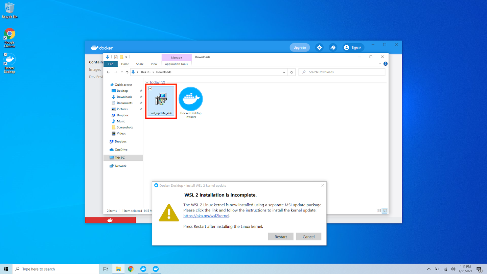

Open the executable and click "Next" on the first screen.

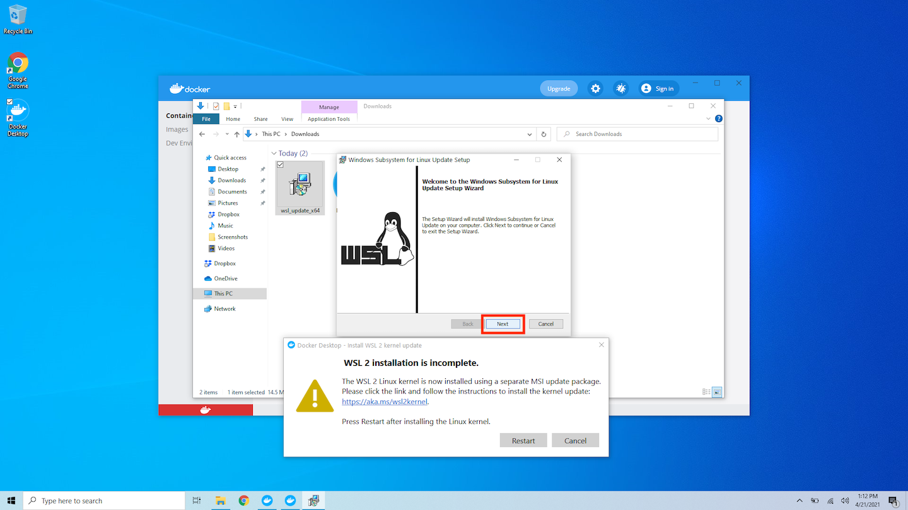

After the setup is complete click the "Finish" button.


Now you can click the "Restart" button on the original notice window.


## 3. Starting Docker Desktop

If everything went well you will see the following message.


And if you open the Docker Desktop application you should see the following window.

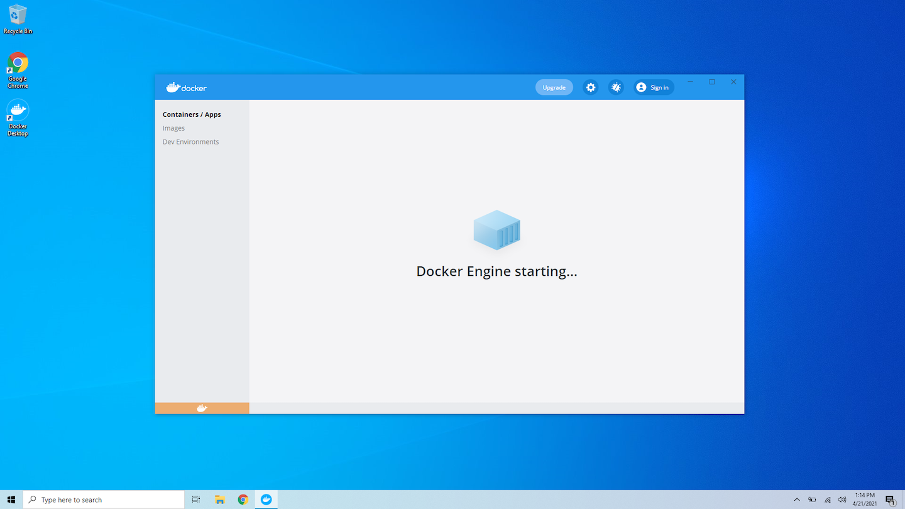

When Docker Desktop starts successfuly you will see the yellow icon turn green.


## 4. Download Taraxa scripts

In order to run the node we need a set of scripts. You can download the scripts from [this link](https://github.com/Taraxa-project/taraxa-ops).

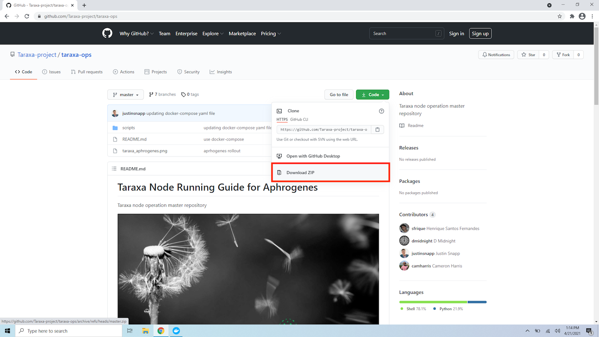


GitHub is blocked in some countries. If you can't access the previous link please refer to the [GitHub is blocked](https://docs.taraxa.io/node-setup/testnet\_node\_setup/github\_blocked) document.


Click on "Download ZIP" under the "Code" menu and the download should start.

After the download is complete you can find a new zip file in your downloads folder.

Right click on the file and select the "Extract All" option.

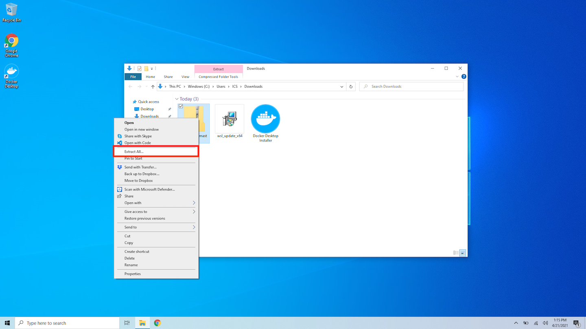

In the first screen click the "Browse" button.


Now select "Desktop" from the left menu.

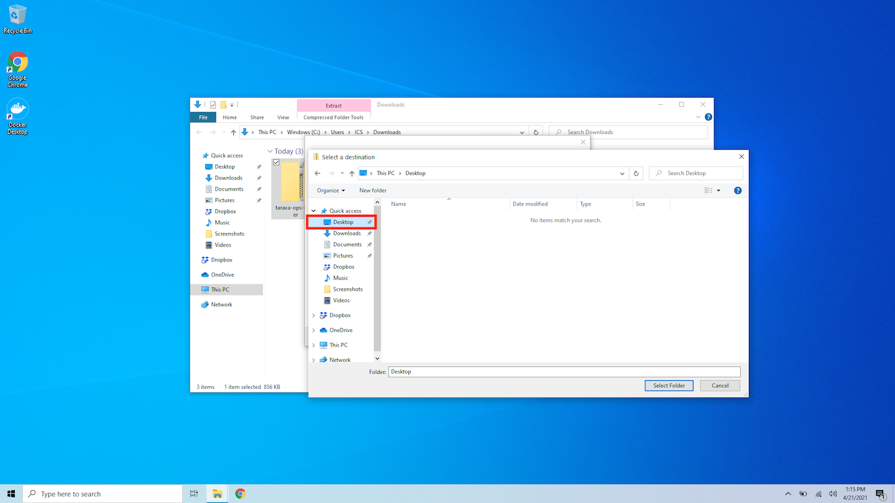

And finally click the "Extract" button.

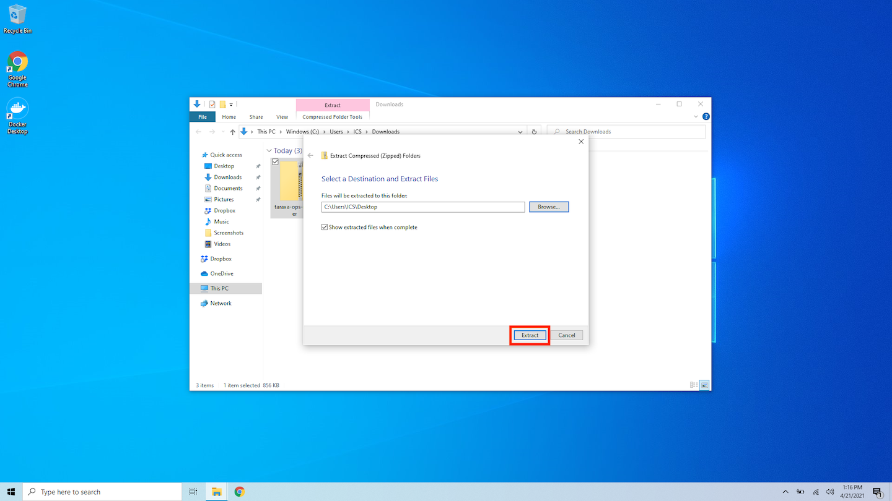

You should see a new folder on your Desktop.


## 5. Start the Taraxa Node

For starting the actual node software we need to use the PowerShell console.

Click on the start menu and type `PowerShell`.

When the application appears open it.


You should see a window similar to this:

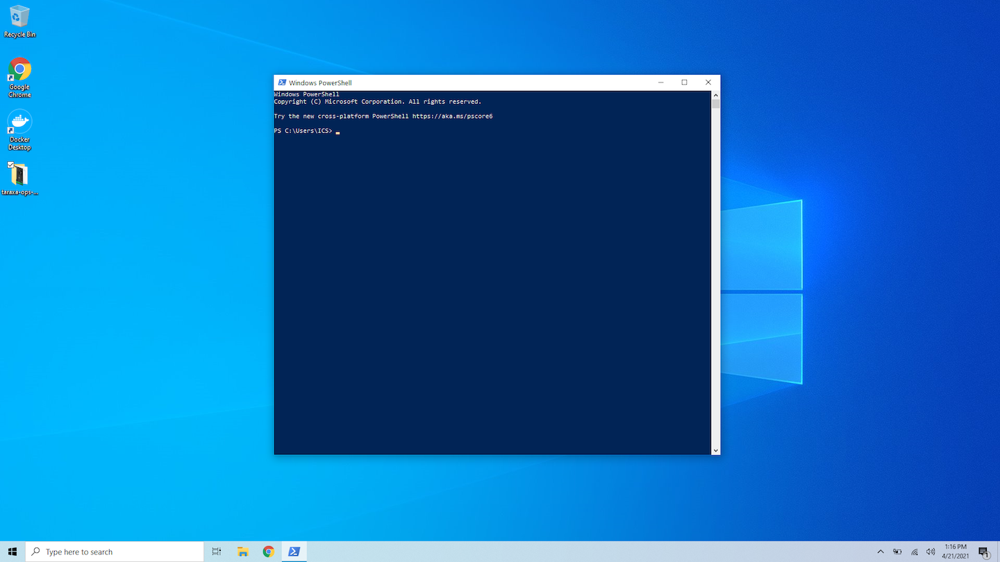

Type the following commands one by one:

```bash
cd .\Desktop\taraxa-ops-master\taraxa_compose\
docker-compose up -d
docker-compose logs -f
```

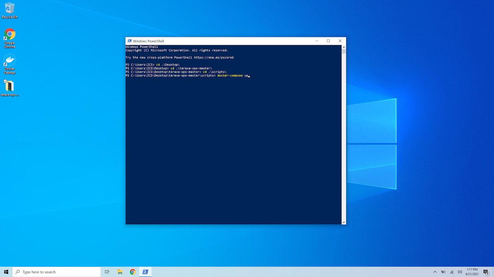

Now docker is pulling the Taraxa Node image. You should see something similar to this:


After it finishes pulling the latest version the node will start and you should see something similar to the following:

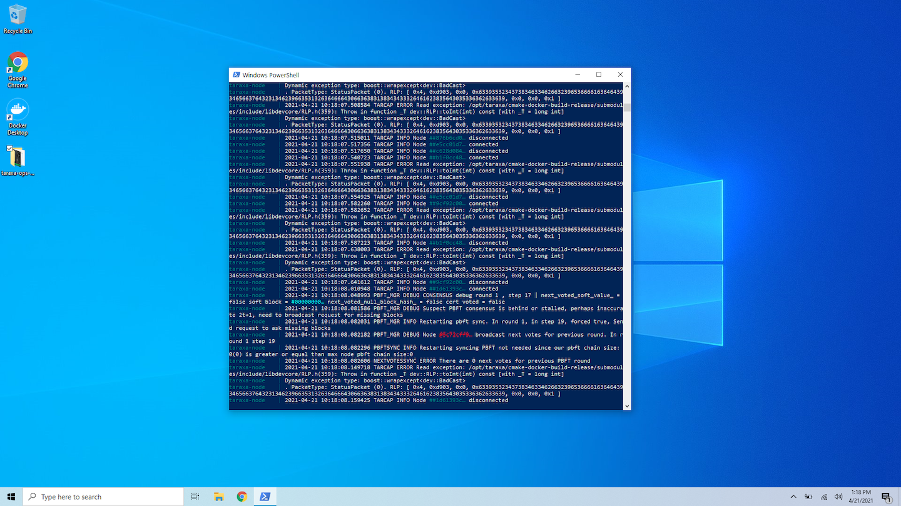

\_NOTE: You can press `CTRL` + `C` to stop displaying the logs

## 6. Update the Taraxa Node

From time to time we will announce software updates and breaking protocol changes to the testnet via the #node-operations channel in our [Taraxa community Discord](https://discord.com/invite/WaXnwUb), Telegram channel and Twitter account.


[upgrade-a-node](../upgrade-a-node/)

