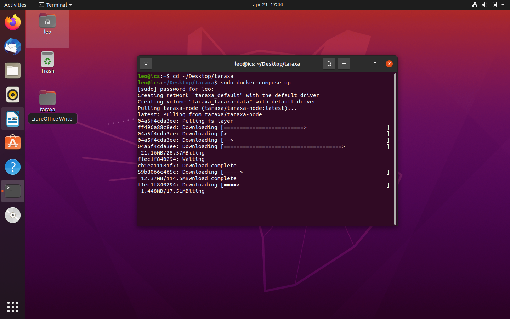
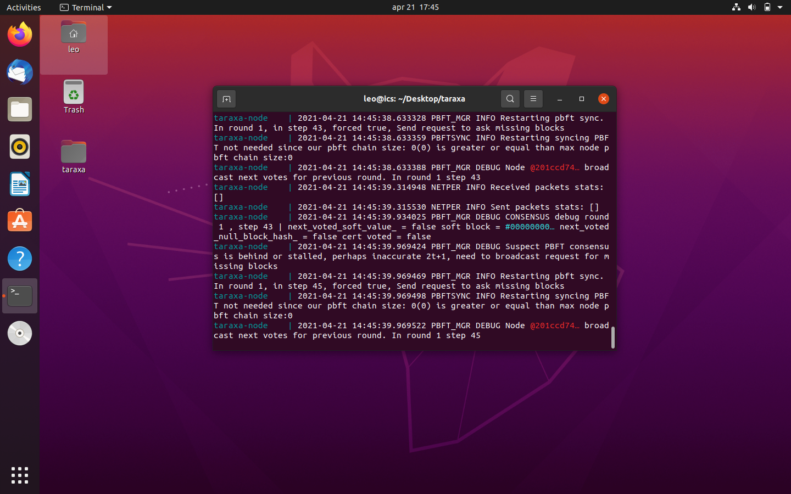

# Linux

## 1. Install Docker

Open a terminal window and run the following commands to install Docker:

```bash
wget -O get-docker.sh https://get.docker.com 
sudo sh get-docker.sh
sudo apt install -y docker-compose
rm -f get-docker.sh
```


## 2. Download the Taraxa Scripts

```bash
cd ~/
wget https://github.com/Taraxa-project/taraxa-ops/archive/refs/heads/master.zip
```


GitHub is blocked in some countries. If you can't run the previous command please refer to the [GitHub is blocked](https://docs.taraxa.io/node-setup/testnet_node_setup/github_blocked) document.


```bash
unzip master.zip
rm -f master.zip
```


## 3. Start the Taraxa Node

```bash
cd ~/taraxa-ops-master/taraxa_compose
sudo docker-compose up -d
sudo docker-compose logs -f
```



The node will start after Docker pulls the latest Taraxa Node image.



_NOTE: You can press `CTRL` + `C` to stop displaying the logs_

## 4. Update the Taraxa Node

From time to time we will release new versions of the node software. Try to keep it up to date using the following commands:

```bash
cd ~/taraxa-ops-master/taraxa_compose
wget -O docker-compose-new.yml https://raw.githubusercontent.com/Taraxa-project/taraxa-ops/master/taraxa_compose/docker-compose.yml && mv docker-compose-new.yml docker-compose.yml
```


GitHub is blocked in some countries. If you can't run the previous command please refer to the [GitHub is blocked](https://github.com/Taraxa-project/taraxa-documentation/tree/f4ee57d43b23f5ad4a2212fa5ec90254d9181f92/node-setup/testnet_node_setup/node-setup/github_blocked.md) document.


```bash
sudo docker-compose down
sudo docker-compose pull
sudo docker-compose up -d
sudo docker-compose logs -f
```

During the testing period, we will also make changes on the protocol level and you will have to re-sync all the data. Don't worry, we will let you know. To remove the current data and do a full re-sync you have to run the following commands:

```bash
cd ~/taraxa-ops-master/taraxa_compose
sudo docker-compose down -v
sudo docker-compose pull
sudo docker-compose up -d
sudo docker-compose logs -f
```

