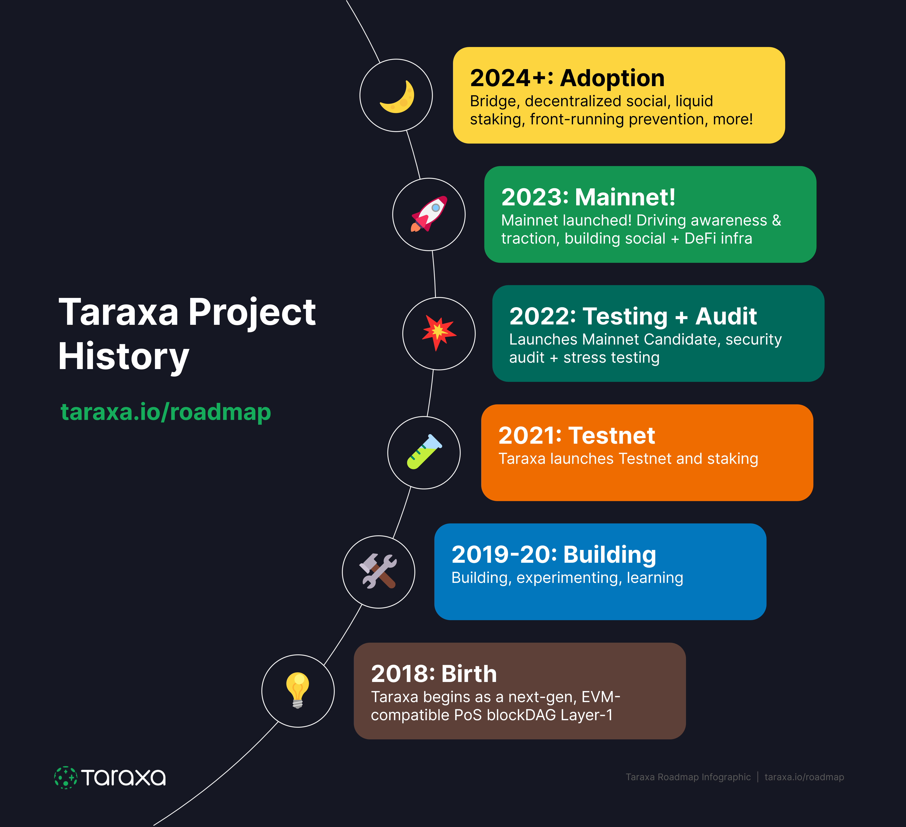

# 🗺 Roadmap

## Brief History

Taraxa was originally conceived in 2018 with a mission to build the next-gen technologies to leverage decentralization to solve real world problems. Here's a brief history of the project,&#x20;

<figure><figcaption></figcaption></figure>

## Rolling 12-Month Roadmap&#x20;

Due to rapid-paced changes, the dev team has transitioned to a rolling roadmap, whereby we periodically update the next 12-month of upcoming development priorities.&#x20;

This roadmap is merely a subset of tasks that the development team is pursuing. The roadmap is a list of confirmed goals that the development team is committed to deliver. What is being constantly discussed and planned is a much larger list of tasks that will be added to the roadmap as their planning becomes clearer.&#x20;

<figure><figcaption></figcaption></figure>

### Q4 2023&#x20;

* Magnolia Hardfork on Mainnet
* Ficus Root Bridge Tech Specs
* Aspen Hardfork (capping TARA supply) on Testnet

### Q1 2024

* Aspen Hardfork (capping TARA supply) on Mainnet
* Ficus Root Bridge on Testnet
* LARA (TARA one-click liquid staking) Beta
* Trendspotter (social trading signals) Beta DEX reference implementation on Testnet
* Token awareness on Explorer (e.g., ERC-20, 721)

### Q2 2024

* DEX reference implementation on Mainnet
* Lending protocol reference implementation on Testnet
* Ficus Root Bridge on Mainnet
* Taraxa Front-Running Resistance Report

### Q3 2024

* Lending protocol reference implementation on Mainnet
* Echo Decentralized Social APIs beta
* Trendspotter APIs
* Ecosystem Dashboard beta

