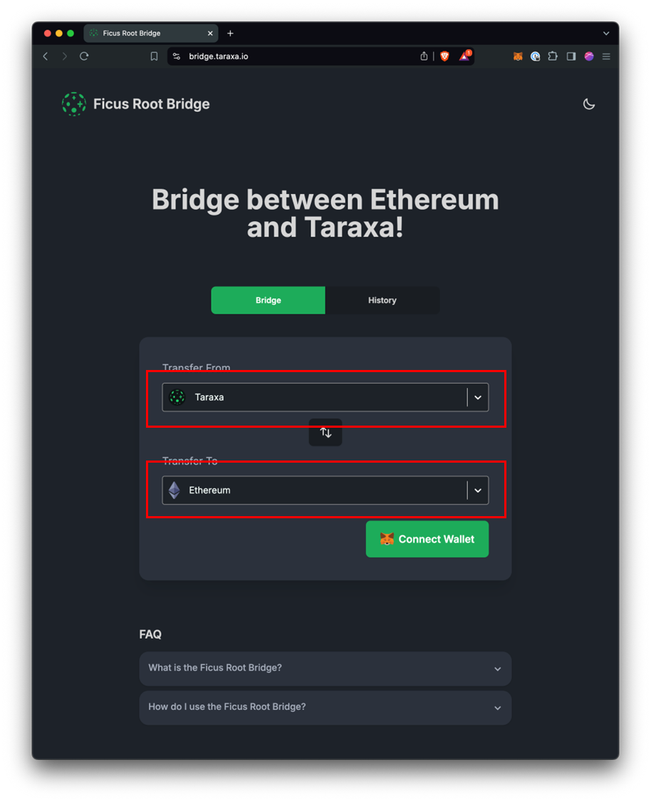

# Metamask

## Adding Custom Networks in Metamask&#x20;

Most ETH-compatible wallets allow you to add a "custom network". As long as that network is ETH-compatible - which Taraxa is - everything just works.&#x20;

You have two options to add Taraxa as a custom network into Metamask: adding it [via Chainlist](metamask.md#option-1-add-taraxa-to-metamask-via-chainlist), or doing it manually yourself.&#x20;

## Add Taraxa to Metamask: via Chainlist&#x20;

The first way to get add the Taraxa network onto Metamask is via [Chainlist](https://chainlist.wtf/). We highly recommend that you reference [Metamask's Chainlist Documentation](https://metamask.zendesk.com/hc/en-us/articles/360058992772).&#x20;

Here's a step-by-step guide for adding Taraxa to Metamask via Chainlist,&#x20;

* Go to [Chainlist](https://chainlist.wtf/)
* Click on "Connect Wallet" on the upper-right corner

<figure><figcaption></figcaption></figure>

* Choose "Metamask" in the pop-up

<figure><figcaption></figcaption></figure>

* Once Metamask is connected, your wallet address will show up on the upper right corner

<figure><figcaption></figcaption></figure>

* Next, search for "Taraxa" in the search bar, and you should be able to see Taraxa's Mainnet and Testnet networks in the search results

<figure><figcaption></figcaption></figure>

* Click on "Add Chain" for the network you wish to join, for example, the Taraxa Mainnet

<figure><figcaption></figcaption></figure>

* You'll see a Metamask pop-up, here's where you can confirm the Taraxa network's connection details, and then click on "Approve"

<figure><figcaption></figcaption></figure>

* Next, Metamask will ask if you'd like to switch to the new network

<figure><figcaption></figcaption></figure>

* Finally, when you open the Metamask browser plugin, you should be able to see "Taraxa Mainnet" at the top, and you're done!&#x20;

<figure><figcaption></figcaption></figure>

## Add Taraxa to Metamask: via Custom Networks

You also have the option to simply add the Taraxa network into Metamask manually. The end result is exactly the same. We highly recommend that you reference [Metamask's Custom Network Documentation](https://metamask.zendesk.com/hc/en-us/articles/360043227612-How-to-add-a-custom-network-RPC#h\_01G63GGJ83DGDRCS2ZWXM37CV5).&#x20;

Here's a step-by-step guide for adding Taraxa to Metamask via manually configuring custom networks,&#x20;

* Open the Metamask browser plugin, click on the network selector button, which will show you a list of networks, at the bottom, there's a "Add Network" button, click on that

<figure><figcaption></figcaption></figure>

* A browser tab will pop out and show Metamask's Add a Network settings, choose "Add a network manually" at the bottom

<figure><figcaption></figcaption></figure>

* Here you'll see a brief form for you fill in details of Taraxa's network

<figure><figcaption></figcaption></figure>

